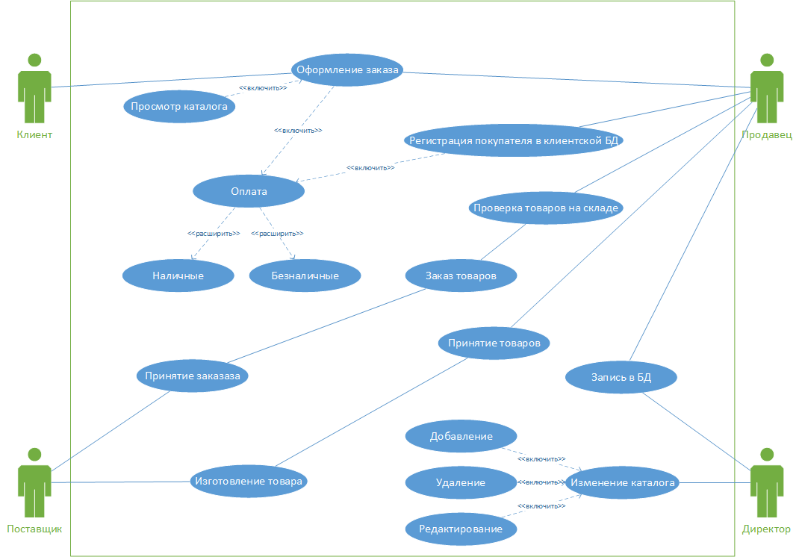
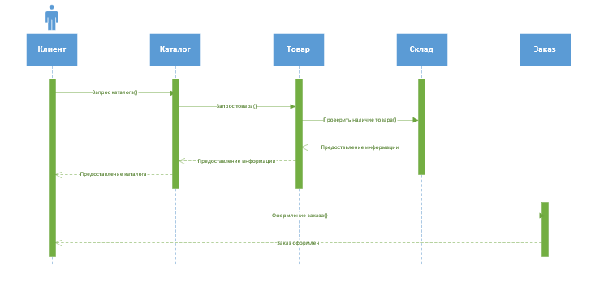
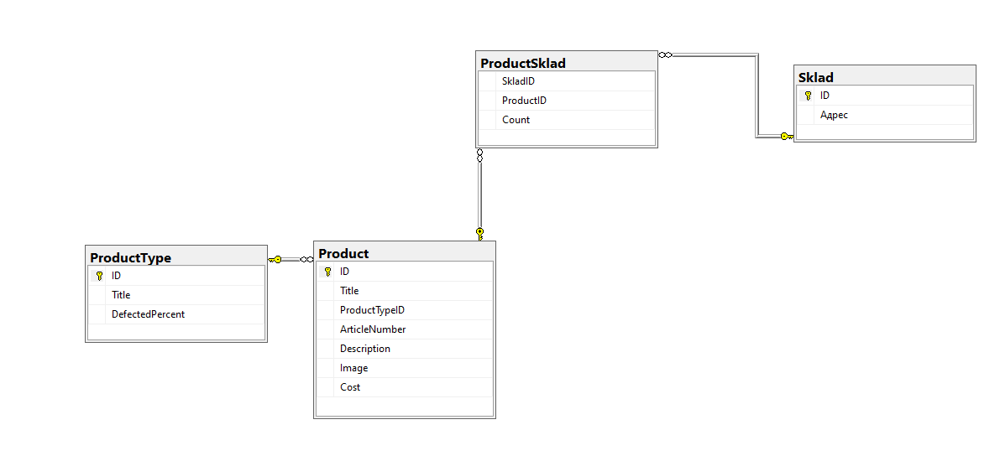
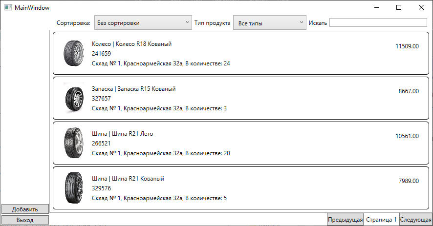
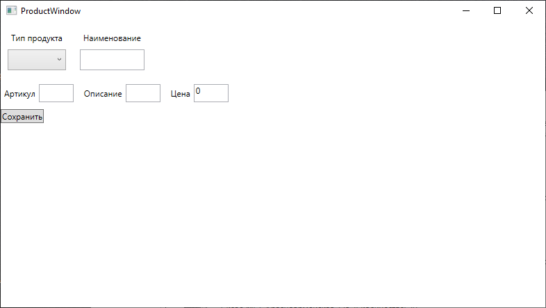
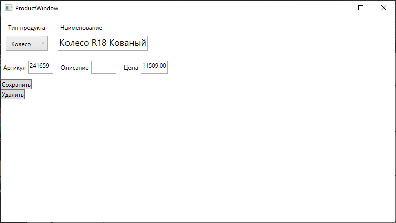

<table style="width: 100%;">
  <tr>
    <td style="text-align: center; border: none;"> 
        Министерство образования и науки РФ <br/>
        ГБПОУ РМЭ "Йошкар-Олинский Технологический колледж 
    </td>
  </tr>
  <tr>
    <td style="text-align: center; border: none; height: 45em;">
        <h2>
            Курсовой проект <br/>
            "Проектирование и разработка информационных систем" <br/>
            группа И-41
        <h2>
    </td>
  </tr>
  <tr>
    <td style="text-align: right; border: none; height: 20em;">
        <div style="float: right;" align="left">
            <b>Разработал</b>: <br/>
            Дудин Дмитрий Игоревич <br/>
        </div>
    </td>
  </tr>
  <tr>
    <td style="text-align: center; border: none; height: 1em;">
        г.Йошкар-Ола, 2021
    </td>
  </tr>
</table>

<div style="page-break-after: always;"></div>

# Содержание

* [Введение](#Введение)
* [Структурный системный анализ](#Структурный-системный-анализ)
* [Разработка и реализация проекта базы данных](#Разработка-и-реализация-проекта-базы-данных)
* [Практическая часть](#Практическая-часть)
* [Заключение](#Заключение)

# Введение

В современном обществе информация стала полноценным ресурсом производства, важным элементом социальной и политической жизни общества. Качество информации определяет качество управления.

В последнее время все больше предприятий сталкиваются с проблемой улучшения управляемости компании: улучшение контроля и ускорение бизнес- процессов, улучшение возможности их отслеживания, оптимизация рабочего времени, экономия трудозатрат, повышение производительности труда и так далее. Единственным способом реализации подобных задач является внедрение информационной системы.

Применение современных информационных технологий имеет важное значение для оптимизации внутренних процессов организации, оперативного доведения информации до исполнителей, улучшения взаимодействия подразделений и отдельных исполнителей в процессе работы с документами, контроля исполнения документов и поручений, поиска информации и определения стадии исполнения документов и их местонахождения, то есть, в конечном счете, способствует более оперативному и качественному решению вопросов, которым посвящены документы. Главное при этом - улучшение взаимодействия всех подразделений организации, повышение управляемости, а также достижение более высокой оперативности в работе.
Для успешного и эффективного функционирования практически любой системы необходимы ведение контроля, анализа и внедрение автоматизации для отдельных процессов или системы в целом. Автоматизация позволяет повысить производительность и качество системы, оптимизировать процессы управления, снизить затраты.
Целью данной курсовой работы является проектирование информационной системы сети компьютерного оборудования, которая позволила бы значительно улучшить качество обслуживания клиентов и упростить процессы оформления продаж компьютерных оборудований, а также достичь максимального результата работы сети магазинов компьютерного оборудования.
Для описания предметной области и проектируемой системы будем использовать диаграммы UML. Язык моделирования UML предоставляет выразительные средства для создания визуальных моделей и обладает рядом значимых преимуществ:

•	UML объектно-ориентирован, в результате чего методы описания результатов анализа и проектирования семантически близки к методам программирования на современных объектно-ориентированных языках;

•	UML позволяет описать систему практически со всех возможных точек зрения и разные аспекты поведения системы;

•	Диаграммы UML сравнительно просты для чтения после быстрого ознакомления с его синтаксисом;

•	UML получил широкое распространение и динамично развивается.

Актуальность темы определяется тем, что информационные системы составляют в настоящее время основу компьютерного обеспечения информационных процессов, входящих практически во все сферы человеческой деятельности.

В настоящее время, несмотря на повышение компьютеризации общества, в данной сфере до сих пор нет средств, позволяющих в достаточной мере автоматизировать процесс ведения документации и отчетности.

О своевременности и актуальности рассматриваемой проблемы говорит тот факт, что большую часть своего времени, заведующая общежития тратит на оформление различной документации и отчетов.

Выше изложенное в целом определило цель исследования: повышение эффективности работы директора магазина за счет разработки и внедрения информационной системы.
Данная информационная система предназначена для хранения информации о товарах, находящихся в магазине, о произведенных оплатах и, с возможностью внесения данных, выборки и изменения данных, вывода информации в необходимом формате.

Объект исследования: Оптовый склад.

Предмет исследования: информационная система, автоматизирующая работу оптового склада.

В соответствии с поставленной целью в проекте определены следующие задачи исследования:

1.	На основе теоретического анализа литературы и Internet-источников произвести анализ предметной области склада.

2.	Провести	функционально-ориентированное	проектирование информационной системы.

3.	Разработать инфологическую модель информационной системы.

4.	Спроектировать логическую структуру информационной системы.

5.	Разработать физическую структуру информационной системы.

6.	Разработать запросы и отчеты к информационной системе.

7.	Разработать интерфейс БД.

8.	Создать руководство пользователя.

# Структурный системный анализ

1.1. Описание предметной области

Для наиболее эффективного производства в любой организации возникает проблема управления данными. Автоматизация позволяет хранить, структурировать и систематизировать большие объемы данных.

Развитие рынка способствовало увеличению количества магазинов, предоставляющих своим клиентам современные и качественные товары, что повлекло за собой обострение конкурентной борьбы и повышение требований по уровню, скорости и удобству обслуживания клиентов.

Для обеспечения конкурентоспособности сети магазинов компьютерного оборудования предлагается внедрить ИС, которая обеспечит:

1.	Для клиентов гарантии как можно более быстрой покупки товара. Это может быть достигнуто, например, сортировкой найденных в поиске товаров по цене, модели, и производителю в базе данных ИС.

2.	Для клиентов ИС должна предоставлять удобный сервис поиска товаров, находящихся в наличии, по базе данных ИС: большой набор критериев поиска и возможности их комбинирования.

3.	С целью поддержания репутации сеть компьютерного оборудования должна исключать технические ошибки.

Итак, при разработке информационной системы необходимо решить следующие проблемы:

Во-первых, создание электронного каталога товаров для клиентов.

Во-вторых, разработать сервис поиска товаров в каталоге.

Увеличение скорости и качества поиска актуальных предложений (на первом этапе) требует разработки и внедрения такой информационной системы, которая предоставляла бы анализ информации о товарах в магазине.

В-третьих, редактирование каталога. Спустя некоторое время данные теряют свою актуальность, что создает новую проблему. Необходимо создать такую систему, которая позволяет менять данные о товарах.

При разработке информационной системы было проведено обследование деятельности склада по следующим источникам:

–	Директором магазина были предоставлены необходимые нормативные документы по правилам добавления продуктов и их хранения;

–	журнал, содержащий требования на заказ товаров, а также сведения по условиям хранения;

–	литература и Internet-источники, описывающие работу склада.

Таким образом, в результате обследования предметной области были определены следующие входные данные:

–	информация о товарах,

–	информация о документах на заказ,

–	информация о платежах,

–	информация об условиях хранения товарах.

К выходным данным относятся отчеты об оплатах за заказы, сведения о поставщиках товаров, сведения о количестве товаров, сведения о товарах.

Для создания информационной модели магазина необходимо осуществить формальное описание его работы. Изучение руководящих документов является первым шагом в изучении процессов работы магазина. Затем, на основе эталонных знаний, исследуется реальная работа директора магазина и сравнивается с указанием руководящих документов. Многократное изучение руководящих документов, периодическое наблюдение за реальными действиями директора и комментарии этого работника позволяют получить знания о функционировании работы магазина, разработать модели.

Товар привозят в магазин, директор проверяет оплату, правильно ли заполнен договор. Если все правильно, она принимает товар на склад. Всю информацию о принятых товарах она записывает в свой журнал. Процесс поиска данных связан с большой проверкой бумажных документов.
Целью решения данной задачи является сведение к минимуму работы директора магазина с бумажными носителями, что ускорит процесс обработки поступающей информации, сократив время ожидания поставщиков, исключит возможную путаницу информации.

Для описания предметной области и проектируемой системы будем использовать диаграммы UML. Язык моделирования UML предоставляет выразительные средства для создания визуальных моделей и обладает рядом значимых преимуществ:

•	UML объектно-ориентирован, в результате чего методы описания результатов анализа и проектирования семантически близки к методам программирования на современных объектно-ориентированных языках;

•	UML позволяет описать систему практически со всех возможных точек зрения и разные аспекты поведения системы;

•	Диаграммы UML сравнительно просты для чтения после быстрого ознакомления с его синтаксисом;

•	UML получил широкое распространение и динамично развивается.

 
1.2 Разработка функциональной модели ИС   

Проектирование информационной системы начинается с этапа построения бизнес-процессов. Для описания бизнес-процессов в информационной системе ,используется диаграмма прецедентов.

Основное назначение диаграммы — описание функциональности и поведения, позволяющее заказчику, конечному пользователю и разработчику совместно обсуждать проектируемую или существующую систему. 

При моделировании системы с помощью диаграммы прецедентов системный аналитик стремится:

•	чётко отделить систему от её окружения;

•	определить действующих лиц (акторов), их взаимодействие с системой и ожидаемую функциональность системы;

•	определить в глоссарии предметной области понятия, относящиеся к детальному описанию функциональности системы (то есть прецедентов).

Для отражения модели прецедентов на диаграмме используются:

•	рамки системы (англ. system boundary) — прямоугольник с названием в верхней части и эллипсами (прецедентами) внутри. Часто может быть опущен без потери полезной информации,

•	актор (англ. actor) — стилизованный человечек, обозначающий набор ролей пользователя (понимается в широком смысле: человек, внешняя сущность, класс, другая система), 
взаимодействующего с некоторой сущностью (системой, подсистемой, классом). Акторы не могут быть связаны друг с другом (за исключением отношений обобщения/наследования),

•	прецедент — эллипс с надписью, обозначающий выполняемые системой действия (могут включать возможные варианты), приводящие к наблюдаемым акторами результатам.

Отношения между прецедентами:

•	обобщение прецедента — стрелка с не закрашенным треугольником (треугольник ставится у более общего прецедента),

•	включение прецедента — пунктирная стрелка со стереотипом «include»,

•	расширение прецедента — пунктирная стрелка со стереотипом «extend» (стрелка входит в расширяемый прецедент, в дополнительном разделе которого может быть указана точка расширения и, возможно в виде комментария, условие расширения).  

Диаграмма последовательности (англ. sequence diagram) — UML-диаграмма, на которой для некоторого набора объектов на единой временной оси показан жизненный цикл объекта (создание-деятельность-уничтожение некой сущности) и взаимодействие актеров (действующих лиц) информационной системы в рамках прецедента.

Основными элементами диаграммы последовательности являются обозначения объектов (прямоугольники с названиями объектов), вертикальные «линии жизни» (англ. lifeline), отображающие течение времени, прямоугольники, отражающие деятельность объекта или исполнение им определенной функции (прямоугольники на пунктирной «линии жизни»), и стрелки, показывающие обмен сигналами или сообщениями между объектами.

### Диаграмма UseCase:

### Диаграмма последовательности:


# Разработка и реализация проекта базы данных

ER-модель (от англ. Entity-Relationship model, модель «сущность — связь») — модель данных, позволяющая описывать концептуальные схемы предметной области.

ER-модель используется при высокоуровневом (концептуальном) проектировании баз данных. С её помощью можно выделить ключевые сущности и обозначить связи, которые могут устанавливаться между этими сущностями.

Во время проектирования баз данных происходит преобразование схемы, созданной на основе ER-модели, в конкретную схему базы данных на основе выбранной модели данных (реляционной, объектной, сетевой или др.).

ER-модель представляет собой формальную конструкцию, которая сама по себе не предписывает никаких графических средств её визуализации. В качестве стандартной графической нотации, с помощью которой можно визуализировать ER-модель, была предложена диаграмма «сущность-связь» (англ. Entity-Relationship diagram, ERD, ER-диаграмма).
Понятия «ER-модель» и «ER-диаграмма» часто не различают, хотя для визуализации ER-моделей могут быть использованы и другие графические нотации, либо визуализация может вообще не применяться (например, использоваться текстовое описание).

Модель была предложена в 1976 году Питером Ченом, им же предложена и самая популярная графическая нотация для модели.

Схема «сущность-связь» (также ERD или ER-диаграмма) — это разновидность блок-схемы, где показано, как разные «сущности» (люди, объекты, концепции и так далее) связаны между собой внутри системы. ER-диаграммы чаще всего применяются для проектирования и отладки реляционных баз данных в сфере образования, исследования и разработки программного обеспечения и информационных систем для бизнеса. ER-диаграммы (или ER-модели) полагаются на стандартный набор символов, включая прямоугольники, ромбы, овалы и соединительные линии, для отображения сущностей, их атрибутов и связей. Эти диаграммы устроены по тому же принципу, что и грамматические структуры: сущности выполняют роль существительных, а связи — глаголов.

Символы и способы нотации ERD.

Диаграммы «сущность-связь» (или ERD) — неотъемлемая составляющая процесса моделирования любых систем, включая простые и сложные базы данных, однако применяемые в них фигуры и способы нотации могут запросто ввести в заблуждение любого. Это руководство поможет вам стать настоящим экспертом по нотации ER-диаграмм и уверенно взяться за моделирование собственных баз данных!

Концептуальные модели данных дают общее представление о том, что должно входить в состав модели. Концептуальные ER-диаграммы можно брать за основу логических моделей данных. 

### ERD:


# Практическая часть
## Программирование

### Данное приложение было разработано в программе Visual Studio.

### Язык програмирования: C#

### В приложение реализованно редактирование товара(двойной клик по товару), реализовано удаление(кнопка в окне редактирования).

#### Главное окно:


##### Код разметки окна:
```xml
<Grid>
        <Grid.ColumnDefinitions>
            <ColumnDefinition Width="100"/>
            <ColumnDefinition Width="*"/>
        </Grid.ColumnDefinitions>
        <StackPanel Orientation="Vertical" Grid.Column="0" HorizontalAlignment="Stretch" VerticalAlignment="Bottom">
            <Button Content="Добавить" Margin="1.5" Name="AddProduct" Click="AddProduct_Click"/>
            <Button Content="Выход" Margin="1.5" Click="Button_Click"/>
        </StackPanel>
        <Grid Grid.Column="1">
            <Grid.RowDefinitions>
                <RowDefinition Height="auto"/>
                <RowDefinition Height="*"/>
                <RowDefinition Height="auto"/>
            </Grid.RowDefinitions>
            <WrapPanel Grid.Row="0" Orientation="Horizontal" ItemHeight="30">
                <Label Content="Сортировка: " Margin="10,0,0,0" VerticalAlignment="Center"/>
                <ComboBox Name="SortTypeComboBox" SelectedIndex="0" VerticalContentAlignment="Center" MinWidth="200" SelectionChanged="SortTypeComboBox_SelectionChanged" ItemsSource="{Binding SortList}"/>
                <Label Content="Тип продукта" VerticalAlignment="Center"/>
                <ComboBox Width="150" x:Name="ProductTypeFilter" VerticalAlignment="Center" SelectedIndex="0" SelectionChanged="ProductTypeFilter_SelectionChanged" ItemsSource="{Binding ProductTypeList}">
                    <ComboBox.ItemTemplate>
                        <DataTemplate>
                            <Label Content="{Binding Title}"/>
                        </DataTemplate>
                    </ComboBox.ItemTemplate>
                </ComboBox>
                <Label Content="Искать" VerticalAlignment="Center"/>
                <TextBox Width="200" VerticalAlignment="Center" x:Name="SearchFiltertextBox" KeyUp="SearchFiltertextBox_KeyUp"/>
            </WrapPanel>
            <ListView Grid.Row="1" ItemsSource="{Binding ProductList}" Name="ProductListView" MouseDoubleClick="ProductListView_MouseDoubleClick">
                <ListView.ItemContainerStyle>
                    <Style TargetType="ListViewItem">
                        <Setter Property="HorizontalContentAlignment" Value="Stretch"/>
                    </Style>
                </ListView.ItemContainerStyle>
                <ListView.ItemTemplate>
                    <DataTemplate>
                        <Border BorderThickness="1" BorderBrush="Black" CornerRadius="5">
                            <Grid Margin="10" HorizontalAlignment="Stretch">
                                <Grid.ColumnDefinitions>
                                    <ColumnDefinition Width="64"/>
                                    <ColumnDefinition Width="*"/>
                                    <ColumnDefinition Width="100"/>
                                </Grid.ColumnDefinitions>
                                <Image Width="64" Height="64" Source="{Binding Path=ImagePreview}"/>
                                <TextBlock Text="{Binding Cost}" Grid.Column="2" HorizontalAlignment="Right" Margin="10"/>
                                <Grid Grid.Column="1" Margin="5">
                                    <Grid.RowDefinitions>
                                        <RowDefinition Height="20"/>
                                        <RowDefinition Height="20"/>
                                        <RowDefinition Height="*"/>
                                    </Grid.RowDefinitions>
                                    <StackPanel Orientation="Horizontal">
                                        <TextBlock Text="{Binding ProductType.Title}"/>
                                        <TextBlock Text=" | "/>
                                        <TextBlock Text="{Binding Title}"/>
                                    </StackPanel>
                                    <TextBlock Text="{Binding ArticleNumber}" Grid.Row="1"/>
                                    <TextBlock Text="{Binding Sklad}" Grid.Row="2"/>
                                </Grid>
                            </Grid>
                        </Border>
                    </DataTemplate>
                </ListView.ItemTemplate>
            </ListView>
            <StackPanel Grid.Row="2" HorizontalAlignment="Right" Orientation="Horizontal">
                <Button Content="Предыдущая" Name="PrevPage" Click="PrevPage_Click"/>
                <TextBlock Text="{Binding CurrentPage, StringFormat=Страница {0}}" VerticalAlignment="Center" Margin="5"/>
                <Button Content="Следующая" Name="NextPage" Click="NextPage_Click"/>
            </StackPanel>
        </Grid>
    </Grid>
```
##### Логика главного окна:

```cs
public partial class Product
    {
        public Uri ImagePreview
        {
            get
            {
                var ImageName = Environment.CurrentDirectory + Image ?? "";
                return System.IO.File.Exists(ImageName) ? new Uri(ImageName) : new Uri("pack://application:,,,/Images/picture.png");
            }
        }
        public string Sklad
        {
            get
            {
                var res = "";
                //res = "Склад № ";
                foreach (var ps in ProductSklad)
                {
                    res = "Склад № " + ps.SkladID + ", " + ps.Sklad.Адрес + ", В количестве: " + ps.Count;
                }
                if(res=="")
                {
                    res = "Нет на складах";
                }
                return res;
            }
        }
    }

    public partial class MainWindow : Window, INotifyPropertyChanged
    {
        public List<ProductType> ProductTypeList { get; set; }
        private IEnumerable<Product> _ProductList;

        public event PropertyChangedEventHandler PropertyChanged;
        private void Invalidate()
        {
            PropertyChanged?.Invoke(this, new PropertyChangedEventArgs("ProductList"));
            PropertyChanged?.Invoke(this, new PropertyChangedEventArgs("CurrentPage"));
        }
        private int _CurrentPage = 1;

        public int CurrentPage
        {
            get
            {
                return _CurrentPage;
            }
            set
            {
                // тут проверка, чтобы номер не уходил в минус и в плюс
                if (value > 0)
                {
                    if ((_ProductList.Count() % 4)==0)
                    {
                        if (value <= _ProductList.Count() / 4)
                        {
                            _CurrentPage = value;
                            Invalidate();
                        }
                    } else
                    {
                        if (value <= (_ProductList.Count() / 4)+1)
                        {
                            _CurrentPage = value;
                            Invalidate();
                        }
                    }
                }
            }
        }

        public IEnumerable<Product> ProductList
        {
            get
            {
                var Result = _ProductList;

                if (SearchFilter != "")
                    Result = Result.Where(ai => (ai.Title.IndexOf(SearchFilter, StringComparison.OrdinalIgnoreCase) >= 0) || (ai.ArticleNumber.IndexOf(SearchFilter, StringComparison.OrdinalIgnoreCase)>=0));

                if (_ProductTypeFValue > 0)
                    Result = Result.Where(ai => ai.ProductType.ID == _ProductTypeFValue);

                switch (SortType)
                {
                    case 1:
                        Result = Result.OrderBy(p => p.Title);
                        break;
                    case 2:
                        Result = Result.OrderByDescending(p => p.Title);
                        break;
                    case 3:
                        Result = Result.OrderBy(p => p.Cost);
                        break;
                    case 4:
                        Result = Result.OrderByDescending(p => p.Cost);
                        break;
                }

                return Result.Skip((CurrentPage - 1) * 4).Take(4);
            }
            set
            {
                _ProductList = value;
            }
        }
        private int SortType = 0;
        public string[] SortList { get; set; } = {
            "Без сортировки",
            "название по убыванию",
            "название по возрастанию",
            "цена по убыванию",
            "цена по возрастанию" };
        public MainWindow()
        {
            InitializeComponent();
            DataContext = this;
            ProductList = Core.DB.Product.ToArray();
            ProductTypeList = Core.DB.ProductType.ToList();
            ProductTypeList.Insert(0, new ProductType { Title = "Все типы" });
        }
        private void PrevPage_Click(object sender, RoutedEventArgs e)
        {
            CurrentPage--;
        }

        private void NextPage_Click(object sender, RoutedEventArgs e)
        {
            CurrentPage++;
        }
        private void SortTypeComboBox_SelectionChanged(object sender, SelectionChangedEventArgs e)
        {
            SortType = SortTypeComboBox.SelectedIndex;
            Invalidate();
        }

        private void AddProduct_Click(object sender, RoutedEventArgs e)
        {
            var AddWindow = new ProductWindow(new Product(),0);
            if (AddWindow.ShowDialog() == true)
            {
                ProductList = Core.DB.Product.ToArray();
                Invalidate();
            }
        }

        private void ProductListView_MouseDoubleClick(object sender, MouseButtonEventArgs e)
        {
            var EditWindow = new ProductWindow(ProductListView.SelectedItem as Product,1);
            if (EditWindow.ShowDialog() == true)
            {
                ProductList = Core.DB.Product.ToArray();
                Invalidate();
            }
        }

        private void Button_Click(object sender, RoutedEventArgs e)
        {
            Application.Current.Shutdown();
        }
        private int _ProductTypeFValue = 0;
        public int ProductTypeFValue
        {
            get
            {
                return _ProductTypeFValue;
            }
            set
            {
                _ProductTypeFValue = value;
                Invalidate();
            }
        }

        private void ProductTypeFilter_SelectionChanged(object sender, SelectionChangedEventArgs e)
        {
            ProductTypeFValue = (ProductTypeFilter.SelectedItem as ProductType).ID;
        }
        private string _SearchFilter = "";
        public string SearchFilter
        {
            get
            {
                return _SearchFilter;
            }
            set
            {
                _SearchFilter = value;
                Invalidate();
            }
        }
        private void SearchFiltertextBox_KeyUp(object sender, KeyEventArgs e)
        {
            SearchFilter = SearchFiltertextBox.Text;
        }
    }
```

#### Окно добавления и редактирования:



##### Код разметки окна:
```xml
<Grid>
        <StackPanel Orientation="Vertical">
            <StackPanel Orientation="Horizontal" Margin="0,10">
                <WrapPanel ItemHeight="30" Orientation="Vertical" Margin="10,0">
                    <Label Content="Тип продукта"/>
                    <ComboBox ItemsSource="{Binding ProdTypeList}" SelectedItem="{Binding CurrentProduct.ProductType}">
                        <ComboBox.ItemTemplate>
                            <DataTemplate>
                                <Label Content="{Binding Title}"/>
                            </DataTemplate>
                        </ComboBox.ItemTemplate>
                    </ComboBox>
                </WrapPanel>
                <WrapPanel ItemHeight="30" Orientation="Vertical" Margin="10,0">
                    <Label Content="Наименование"/>
                    <TextBox Text="{Binding CurrentProduct.Title}" FontSize="18"/>
                </WrapPanel>
            </StackPanel>
            <StackPanel Orientation="Horizontal" Margin="0,10">
                <Label Content="Артикул"/>
                <TextBox Text="{Binding CurrentProduct.ArticleNumber}" MinWidth="50" Margin="0,0,10,0"/>
                <Label Content="Описание"/>
                <TextBox Text="{Binding CurrentProduct.Description}" MinWidth="50" Margin="0,0,10,0"/>
                <Label Content="Цена"/>
                <TextBox Text="{Binding CurrentProduct.Cost}" MinWidth="50" Margin="0,0,10,0"/>
            </StackPanel>
            <Button x:Name="SaveButton" Content="Сохранить" Click="SaveButton_Click" HorizontalAlignment="Left"/>
            <Button x:Name="DeleteButton" Content="Удалить" Click="DeleteButton_Click" HorizontalAlignment="Left"/>
        </StackPanel>
    </Grid>
```
##### Логика данного окна:

```cs
public partial class ProductWindow : Window
    {
        public Product CurrentProduct { get; set; }
        public IEnumerable<ProductType> ProdTypeList { get; set; }
        public IEnumerable<ProductSklad> SkladList { get; set; }
        public Sklad CurSklad;
        public ProductWindow(Product CurProduct,int type)
        {
            InitializeComponent();
            DataContext = this;
            CurrentProduct = CurProduct;
            ProdTypeList = Core.DB.ProductType.ToArray();
            SkladList = Core.DB.ProductSklad.ToArray();
            if (type == 0)
            {
                DeleteButton.Visibility = Visibility.Collapsed;
            } else
            {
                DeleteButton.Visibility = Visibility.Visible;
            }
        }

        private void SaveButton_Click(object sender, RoutedEventArgs e)
        {
            try
            {
                if (CurrentProduct.ProductType == null)
                    throw new Exception("Не выбран Тип продукта");
                if (CurrentProduct.Title == "")
                    throw new Exception("Не выбрано Наименование");
                if (CurrentProduct.ArticleNumber == null)
                    throw new Exception("Не указан артикул");
                if (CurrentProduct.Cost == 0)
                    throw new Exception("Не указан цена");
                if (CurrentProduct.ID == 0)
                    Core.DB.Product.Add(CurrentProduct);
                Core.DB.SaveChanges();
                DialogResult = true;
            }
            catch (Exception ex)
            {
                MessageBox.Show($"Ошибка: {ex.Message}");
            }
        }

        private void DeleteButton_Click(object sender, RoutedEventArgs e)
        {
            if (CurrentProduct.ProductSklad.Count > 0)
            {
                MessageBox.Show("Нельзя удалить товар, который лежит на складе");
                return;
            }
            try
            {
                Core.DB.Product.Remove(CurrentProduct);
                Core.DB.SaveChanges();
                DialogResult = true;
            }
            catch (Exception ex)
            {
                MessageBox.Show($"Ошибка при удалении товара: {ex.Message}");
            }
        }
    }
```

# Заключение

В ходе выполнения курсового проекта средствами MySQL была разработана информационная система ,предназначенная для автоматизации работы директора склада.

Концептуальная модель данных представлена диаграммой «сущность- связь». На ее основании разработана логическая структура базы данных, в ходе реализации которой задействованы механизмы обеспечения целостности данных.

Создание главной формы доступа к данным позволяет пользователям легко просматривать, обновлять или анализировать данные.

Разработанное приложение просто в применении и может быть использовано в любом магазине.

Формы отображают информацию из таблиц в удобном виде, а также служат для ввода данных в таблицы.

Сопоставление результатов проекта с поставленными задачами позволяет заключить следующее:

1.	На основе теоретического анализа литературы и Internet-источников произведен анализ предметной области склада.

2.	Проведено	функционально-ориентированное	проектирование информационной системы.

3.	Разработана инфологическая модель данных.

4.	Спроектирована логическая структура информационной системы.

5.	Разработана физическая структура информационной системы.

6.	Разработаны запросы, отчеты к информационной системе.

7.	Разработан интерфейс БД.

8.	 Таким образом, следует считать, что задачи курсового проекта полностью выполнены и цель исследования достигнута.


